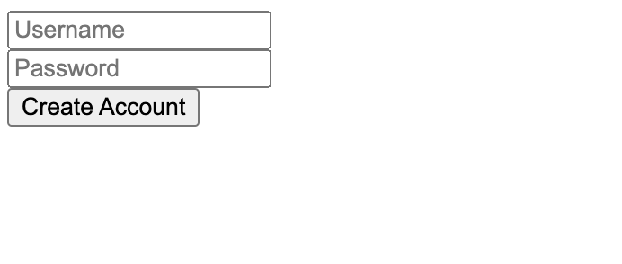
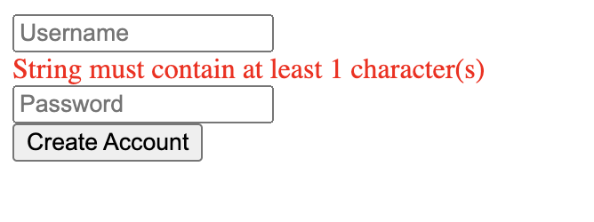
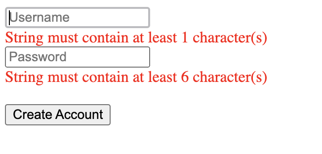

import { Callout, Tab, Tabs, Steps } from 'nextra-theme-docs'

# Get Started

## Installation

To get started, you should have setup a TypeScript React project (more frameworks to come). If you are new to React, we encourage you to setup your project using [Vite](https://vitejs.dev/) or [NextJS](https://nextjs.org). After you have settled down, run the commands below for your package manager of choice.

<Tabs items={['pnpm', 'npm', 'yarn']}>
  <Tab>
    ```bash
    pnpm add mobx mobx-react zod @monoid-dev/mobx-zod-form @monoid-dev/mobx-zod-form-react
    ```
  </Tab>
  <Tab>
    ```bash
    npm i mobx mobx-react zod @monoid-dev/mobx-zod-form @monoid-dev/mobx-zod-form-react
    ```
  </Tab>
  <Tab>
    ```bash
    yarn add mobx mobx-react zod @monoid-dev/mobx-zod-form @monoid-dev/mobx-zod-form-react
    ```
  </Tab>
</Tabs>

<Callout>
  Since `zod` makes it a requirement to have `compilerOptions.strict: true`, you should ensure the same thing in your `tsconfig.json`.
</Callout> 

## Your First Mobx Zod Form

In your React project's root, copy-paste the following code to your entrypoint:

@include "../components/examples/get-started.tsx"

Then open your browser, you might see the form UI like this, if everything goes well.



This might not be the best UI in the world, but it is as functional-complete as any real world forms.

Try to edit the Username field, then clean it up, you'll see an error below it.



This acts like most users expect, and also makes the dev feel at home if they are Formik or React Hook Form users. You probably don't want to see any red lines when the form is untouched; we only alert the user for mistakes if they have touched the field.

Then, enter complete information, and click submit, you'll see a popup on the screen, as we state in `bindForm`:

@include "../components/examples/get-started.tsx#bindForm"

Then, refresh the page, and click `Create Account` directly, you'll see the following:



You now see the errors are under every input box, and if you look even closer, you find the `Username` input is automatically focused. The errors are displayed, even though the user hasn't interacted with their UI yet.

This is also what we want to see when the user clicks and the form fails validation. From the aspect of users, they probably don't want to see a gray submit button, if they have pages of inputs to fill but don't know which one is missing. The submit button should always be clickable, and navigate the user back to where they miss something. The errors are displayed eagerly to guide the user to correct them.
