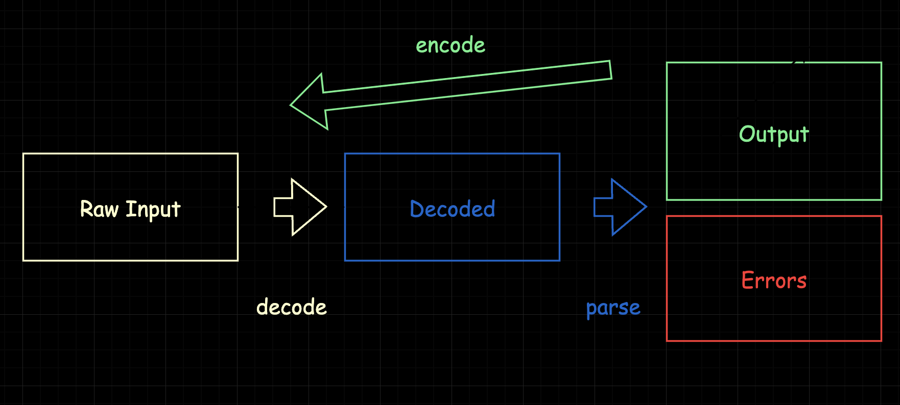

import { Callout, Tab, Tabs, Steps } from 'nextra-theme-docs'

# Guide

## Basic Concepts

### Schemas and Fields

What is a schema? According to Zod's [documentation](https://zod.dev), schema refers to any data type.

> Zod is a TypeScript-first schema declaration and validation library. I'm using the term "schema" to broadly refer to any data type, from a simple string to a complex nested object.

We have defined a schema before:

```
@include "../components/examples/guide.tsx#schema"
```

A schema can parse data from the outside world, and throws meaningful error if the input does not satisfy it.

Our form is built based on the schema. Here, we have two properties, `username` and `password` to fill out. According to those properties, we should have two `<input>` elements, wrapped in a form:

```
@include "../components/examples/guide.tsx#basic-form"
```

Here, we have

```
@include "../components/examples/guide.tsx#basic-form-fields"
```

as our **fields** for property `username` and `password` respectively.

<Callout>
  A schema is any data type.   
  A field is a piece of UI to control a part of that schema. Plus, a form is the collection of fields to fill out a schema.
</Callout>

### Form and Field Controllers

To make our application better react with the user, we need to do better than plain HTML native forms.

`mobx-zod-form-react` provides a `useForm` hook which returns a `ReactForm` instance to manage the form and the fields.

```
@include "../components/examples/guide.tsx#use-form"
```

The `ReactForm` returned by `useForm` is a referential-stable [observable object](https://mobx.js.org/react-integration.html). Your components will re-render on its changes it you read its observable properties. We also see that `observer` is required to wrap our component, if we want the `Form` to react on `form`'s changes. Your form will not react if `observer` is not applied. Let's first bind the form to our HTML form and see the key properties and methods.

<Callout>
  Always remember to wrap your form with `observer` from `mobx-react` or it simply doesn't react!
</Callout>

```
@include "../components/examples/guide.tsx#bind-form"
```

First of all, we visit `form.root`. It is a `MobxZodObjectField` object that lies at the root of your schema, corresponding to the root schema you passed to `useForm`. `form.root.fields` is the record of fields, each value being a `MobxZodField` to manage a text field.

```
@include "../components/examples/guide.tsx#schema"
```

Although other libraries might enforce an object, but the root schema could be `Array`, `string`, `number` or anything else. We use TypeScript generic types to map them to corresponding `MobxZodField`.

Then, we call `form.bindField` for input objects against each property from `form.root.fields`.

```
@include "../components/examples/guide.tsx#bind-field-1"
```

```
@include "../components/examples/guide.tsx#bind-field-2"
```

This effectively applies a list of props to that `<input />` element: `value`, `onChange`, `onBlur`, `ref`, `type`, `checked`, `name`, `id`. By doing that, we have everything we need to bind the input to our `ReactForm` and perform validation, state management and UI utilities.

While `bindField` does a lot of stuff under the hood, `bindForm` is easier to master. It provides a idiomatic `onSubmit` handler for the form, which stops the event from propagating, sets `action` to `#` so that the page won't refresh after you click the submit button, attaches a `ref` so that `form.element` is set to the form element, and calls the user `onSubmit` when the validation is passed and `onSubmitError` when the validation is failed.

```
@include "../components/examples/guide.tsx#bind-form-1"
```


### The Data Flow



#### Raw Value Decoding

We have three-step data conversion step in Mobx Zod Form, which enables an error-tolerant and two-way dataflow. Consider the example below.

We have a `z.number().min(1)`, and:

+ Case One
  + The user inputs `"3"`.
  + We know we expect a `number` here, so we cast it to number `3` (decode step).
  + Zod parses the `3`, checks if it is `>= 1` (parse step).
  + Success! We get output `3`.
  
+ Case Two
  + The user inputs `"three"`
  + We know we expect a `number` here, but we cannot converse it to a non-NaN number, so we pass the number as-is (decode step).
  + Zod parses the `"three"`, which results in a `invalid_type` (parse step).
  + Failed! We get the error message `Expect number, get string` from Zod.

+ Case Three
  + The user inputs `"0"`.
  + We know we expect a `number` here, so we cast it to number `0` (decode step).
  + Zod parses the `0`, checks if it is `>= 1`, getting a `too_small` (parse step).
  + Failed! We get the error message `Number must be greater than or equal to 1`.
  
We design the dataflow, especially "insert" the decode step, based on these facts:

1. The data we understand is not the data we store.
   1. As illustrated above, we need `number`, but the `HTMLInputElement` stores `string`. It is not always the case we can directly `Number(value)` to `number`.
2. We need to handle partially correct data.
   1. Zod parses the data in one shot, and returns either the fully correct output or the original input with the errors. But this is not the case in forms. Consider we have a list of items `Item[]`, each item have `z.object({ name: z.string(), price: z.number().gt(0) })`, and we want to sum the price in real time: `sumBy(items, item => item.price)`.
   2. Now consider we have an "almost correct input" `[{ name: "Milk", price: "2.99" }, { name: "Coke", price: "0.99" }, { name: "Coffee", price: "" }]`
   3. However, the list doesn't make sense to zod. It will not give us `Item[]` as output but only complains the input at `[2, "price"]` is not a number.
   4. We expect we could handle the input's correctness individually in a systematic way.
  
You can observe the decode result using `field.decodeResult`, and read `output` at `onSubmit` callback.

```tsx {13, 20}
@include "../components/examples/guide.tsx#decode-result"
```

#### Output Encoding

Output is the value that makes sense to your program. For example,

```ts
{
  "name": "Mono",
  "age": 10
}
```

It makes sense to our program. However, the following value doesn't make sense to us:

```ts
{
  "name": "Mono",
  "age": "10"
}
```

The object might represent a HTML form, where `age` is stored as `"10"` in an `HTMLInputElement`.

or `name=Mono&age=10` in the query string. In either case, we make "compromises" to the storage so that our object can be represented their, be it an `HTMLInputElement` or query string. In Mobx Zod Form, we implement some simple rules to do that for you, namely **Output Encoding**.

The encoding is mostly transparent to the user. You declare a Zod type, and we handle the mapping from the output type represented by the type to the values in the form automatically. That means, you write:

```ts
z.object({
  name: z.string(),
  age: z.number(),
})
```

and we encode it into

```ts
{
  "name": "Mono",
  "age": "10"
}
```

because we are using DOM to store our values.

#### Empty Token

Use the empty token to represent an "emptyish" value, which will be encoded as "empty" according to the type at its position. Not necessarily a valid raw input. 

```tsx
@include "../components/examples/guide-empty.tsx"
```

| Type | Encoded | Decoded |
|----|----|----|
| ZodString | `""` | `""` |
| ZodNumber | `""` | `undefined` |
| ZodBoolean | `undefined` | `undefined` |
| ZodOptional | `undefined` | `undefined` |
| ZodNullable | `""` for inner type `ZodString` and `ZodNumber`, `null` for other  | `null` |
| ZodLiteral | `""` for inner type `ZodString` and `ZodNumber`, `undefined` for other | `undefined` |
| ZodAny | `undefined` | `undefined` |
| ZodObject | An object each value being its initial output | - |
| ZodArray | `[]`| `[]` |
| ZodDiscriminatedUnion | The first option's emptyish value | - |
| ZodEffects | Inner type's emtyish value | - |
| MobxZodBox | `undefined` | `undefined`


### Touched and Error Messages

Every `MobxZodField` has observable `touched: boolean` and `errorMessages: string[]` properties. They are key to the reaction to the user's input.

Idiomatically, we expect `touched === false` when the user hasn't interacted with the field yet. For `bindField`, we set `touched = true` for the `onBlur` event, which happens when the user has focused on the field then go away.

For custom fields, we expect you to call `field.setTouched` when the user has interacted with the field. For example, for a custom upload button, the timing might be the time that the user has closed the file selector. For a custom input that opens a dialog, the timing might be the time that the user has closed the dialog. 

The validation happens as a whole on the root data, and needs to be triggered. By default, the validation is triggered after any changes to the raw input in a `requestIdleCallback`. After the validation fails, `zod` returns us a list of `ZodError`. Each `zod` error contains a `path: string[]`, a `messages: string[]`, and other properties. We find the field according to the `path` and attach the `messages` to its `errorMessages` field.


### Focus Error

Focusing to the first error is automatically enabled. The order is by default determined by its y-position, then x-position. To be more specific, when there is a `onSubmit` event happens to the form, the validation will be triggered for the form. If there is an error, after calling the `onSubmitError` custom handler, it will find all the fields with a non-empty `errorMessages`. Then, it calls `.focus()` on the first HTML element bound to those fields, if there's any.

<Callout>
  If you bind your field to a non-focusable element, `.focus()` will not work. Add `tabindex="0"` to make it focusable.

  See: https://developer.mozilla.org/en-US/docs/Web/HTML/Global_attributes/tabindex
</Callout>

### Form Submission

To submit a form, you have two ways:

1. Pass the `.bindForm` with your submission handlers to the `form` element. In this case, the form submission is trigger by `onSubmit` DOM event, usually originated from a `type="submit"` button.
2. Call the `handleSubmit` method on the form directly.

<Callout>
`.bindForm` is recommended because the submission is triggered no matter where your button is, as long as it is inside the `form`, and it is nice to put your submission logic in the top level of your form instead of with the button.
</Callout>

The form then does the following tasks:

1. Trigger a prioritized validation. (should happen within the next microtask)
2. Mark all fields as `touched`.
3. Trigger your custom `onSubmit` or `onSubmitError`.
4. Focus on the first error.

You can observe the submission using `.isSubmitting` and `.submitCount` on the form instance.

The process should match Formik's [Form Submission](https://formik.org/docs/guides/form-submission). However, we have a less-used `onSubmitError` custom handler in case you want to react to the user besides the error message.

### Conventional Fields

Types are mapped to fields with default rules. For atomic types, i.e. `ZodString`, `ZodNumber`, and `ZodBoolean`, etc, are mapped to atomic fields with no child fields. For complex types, `ZodObject` and `ZodArray`, etc, are mapped to complex fields containing child fields. You can also construct your own fields using [Boxed Fields](#boxed-fields).

#### MobxZodField

The following types are mapped to an atomic `MobxZodField`.

1. `ZodString`
2. `ZodNumber`
3. `ZodBoolean`
4. `ZodEnum`
5. `ZodOptional`
6. `ZodNullable`
7. `ZodLiteral`

See [interface MobxZodField](/api-reference/interfaces/_monoid_dev_mobx_zod_form.MobxZodField.html)

#### MobxZodOptionalField & MobxZodNullableField

The following types are mapped to an `MobxZodOptionalField<T>` or `MobxZodNullableField<T>`.

1. `ZodOptional<T>`
2. `ZodDefault<T>`

See [interface MobxZodOmittableField](/api-reference/interfaces/_monoid_dev_mobx_zod_form.MobxZodOmittableField.html)

#### MobxZodObjectField

`ZodObject` will be mapped to this field.

See [interface MobxZodObjectField](/api-reference/interfaces/_monoid_dev_mobx_zod_form.MobxZodObjectField.html)

#### MobxZodArrayField

`ZodArray` will be mapped to this field.

See [interface MobxZodArrayField](/api-reference/interfaces/_monoid_dev_mobx_zod_form.MobxZodArrayField.html)

#### Discriminated Union

`ZodDiscriminatedUnion` will be mapped to `MobxZodDiscriminatedUnionField`.

See [interface MobxZodDiscriminatedUnionField](/api-reference/interfaces/_monoid_dev_mobx_zod_form.MobxZodDiscriminatedUnionField.html)


### Boxed Fields

A boxed field is treated as an atomic value, as if it is a `string` or `boolean`. That means, even the type represents an `object` or `array`, we don't create subfields for it. This is useful for you to implement your own logic free of the defaults.

Use the `box` extended ZodType method for creating a boxed field.

```ts
const form = useForm({
  file: z.object({
    url: z.string(),
    name: z.string(),
  }).box()
});
```

Then `form.root.fields.file` should of type `MobxZodField`.

### Plugins

<Callout type="warning" emoji="⚠️">
  Plugins are objects with methods that are run on different timings, along with native tasks, so use them with care. Throwing an error might break other plugins or native tasks, so errors should be handled inside. Plugins are mainly used to synchronous tasks, so you may want to move asynchronous tasks to `onSubmit`.
</Callout>

You can use plugins to run various effects on various timings. For example, the following plugin `fill-username-with-aaaa` sets the `username` field to `"aaaa"` (no matter what the user inputs).

```tsx
@include "../components/examples/guide.tsx#plugin"
```

For more, please check the `MobxZodPlugin` type and the API reference.

Please notice that plugins are not meant to intercept the validation results provided by Zod. To achieve that, use the original `superRefine` method.

### Server-side Rendering

Invoking `form.bindField` introduces unique `id` to each field, which is passed to HTML properties. This renders something like:

```html
<input name="search" id="search__:R3l8p:2" type="text">
```

The tail part `:R3l8p:2` is ensured to be unique.

Normally, you don't need to worry about the sameness of the random id on the server and client, because we use [useId](https://react.dev/reference/react/useId) from react 18 to ensure that, inside the body of `useForm`.

Not being a part of the public API, but the unique part is comprised of the result of `useId` and the order of the field created on the server. As long as you create the same form on the server and client during the first rendering, there is no mismatch.

```
<useId><order>
```

However, if you are using `MobxZodForm` directly, you would better provide an SSR-safe `id` to its `option` if you are doing SSR.

## Advanced Usages

Didn't find what you need in the Guide? Take a look at [API Reference](/api-reference/index.html) to see if you can hack.

